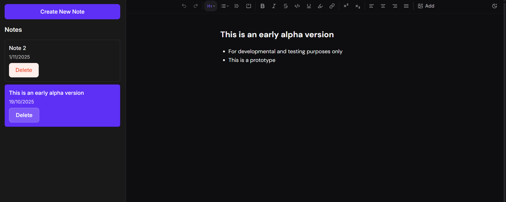

# Notes App

A modern, feature-rich note-taking application built with React and Firebase. Create, edit, and manage your notes with a powerful rich-text editor.

**Live Demo**: [https://notes-app-96d42.web.app](https://notes-app-96d42.web.app)

## 🚧 Status

**Alpha Version** - This is an early alpha build. Things might break, and data could be wiped anytime. Still in active development.

## Features

- **Google Authentication** - Secure sign-in with Google OAuth
- **Rich Text Editor** - Powered by TipTap with extensive formatting options
  - Text formatting (bold, italic, underline, strikethrough, code)
  - Headings (H1-H6)
  - Lists (bullet, ordered, task/todo lists)
  - Text alignment (left, center, right, justify)
  - Blockquotes and code blocks
  - Image uploads
  - Link management
  - Text highlighting with multiple colors
  - Superscript/subscript
  - Horizontal rules
- **Auto-Save** - Changes automatically saved after 3 seconds of inactivity
- **Real-time Sync** - Notes synchronized across devices using Firestore
- **Dark/Light Mode** - Theme toggle for comfortable writing
- **Fast & Modern** - Built with Vite for lightning-fast development and builds

## Screenshot



## Tech Stack

- **Frontend**: React 19, Vite 7
- **Styling**: Tailwind CSS 4, SCSS
- **Rich Text Editor**: TipTap 3
- **Backend**: Firebase
  - Authentication (Google Sign-In)
  - Firestore (Database)
  - Hosting
- **Routing**: React Router DOM
- **UI Components**: Radix UI, Floating UI

## Getting Started

### Prerequisites

- Node.js (v16 or higher)
- npm
- Firebase account

### Installation

1. **Clone the repository**
   ```bash
   git clone https://github.com/hydrolox-0/app-notes.git
   cd app-notes
   ```

2. **Install dependencies**
   ```bash
   npm install
   ```

3. **Set up Firebase**
   - Create a Firebase project at [Firebase Console](https://console.firebase.google.com)
   - Enable Google Authentication
   - Create a Firestore database
   - Copy your Firebase config

4. **Configure environment variables**
   Create a `.env` file in the root directory:
   ```env
   VITE_FIREBASE_API_KEY=your_api_key
   VITE_FIREBASE_AUTH_DOMAIN=your_auth_domain
   VITE_FIREBASE_PROJECT_ID=your_project_id
   VITE_FIREBASE_STORAGE_BUCKET=your_storage_bucket
   VITE_FIREBASE_MESSAGING_SENDER_ID=your_sender_id
   VITE_FIREBASE_APP_ID=your_app_id
   VITE_FIREBASE_MEASUREMENT_ID=your_measurement_id
   ```

5. **Run development server**
   ```bash
   npm run dev
   ```
   Open [http://localhost:5173](http://localhost:5173) in your browser

## Build & Deploy

### Build for Production

```bash
npm run build
```

This creates an optimized production build in the `dist` folder.

### Deploy to Firebase

1. **Login to Firebase**
   ```bash
   firebase login
   ```

2. **Deploy**
   ```bash
   firebase deploy --only "hosting,firestore"
   ```

Your app will be live at `https://your-project-id.web.app`

## Project Structure

```
app-notes/
├── src/
│   ├── @/                      # TipTap editor components
│   │   ├── components/         # UI primitives, nodes, templates
│   │   ├── hooks/              # Editor-specific hooks
│   │   ├── lib/                # Utility functions
│   │   └── styles/             # SCSS variables and animations
│   ├── components/             # App components
│   │   ├── Editor.jsx
│   │   ├── Header.jsx
│   │   └── ...
│   ├── firebase/               # Firebase configuration
│   ├── hooks/                  # Custom React hooks
│   │   ├── useAuth.js
│   │   └── useNotes.js
│   ├── pages/                  # Page components
│   │   ├── LoginPage.jsx
│   │   ├── NotesPage.jsx
│   │   └── SharedNotePage.jsx
│   ├── utils/                  # Utility functions
│   ├── App.jsx                 # Main app component
│   └── main.jsx                # Entry point
├── public/                     # Static assets
├── dist/                       # Production build
├── firebase.json               # Firebase configuration
├── firestore.rules             # Firestore security rules
└── package.json                # Dependencies
```

## Security

- Firestore rules require authentication for read/write operations
- Google OAuth for secure authentication
- All data is user-scoped and private

## Contributing

This is a student project in active development. Contributions, issues, and feature requests are welcome!

1. Fork the repository
2. Create your feature branch (`git checkout -b feature/AmazingFeature`)
3. Commit your changes (`git commit -m 'Add some AmazingFeature'`)
4. Push to the branch (`git push origin feature/AmazingFeature`)
5. Open a Pull Request

## License

This project is open source and available under the MIT License.

## Author

**hydrolox-0**
- GitHub: [@hydrolox-0](https://github.com/hydrolox-0)

## Acknowledgments

- [TipTap](https://tiptap.dev/) - Rich text editor
- [Firebase](https://firebase.google.com/) - Backend infrastructure
- [Tailwind CSS](https://tailwindcss.com/) - Utility-first CSS framework
- [Vite](https://vitejs.dev/) - Next generation frontend tooling

---

**Beware of bugs and lack of features**: This app is in early alpha. Expect bugs and breaking changes. Use at your own risk!
